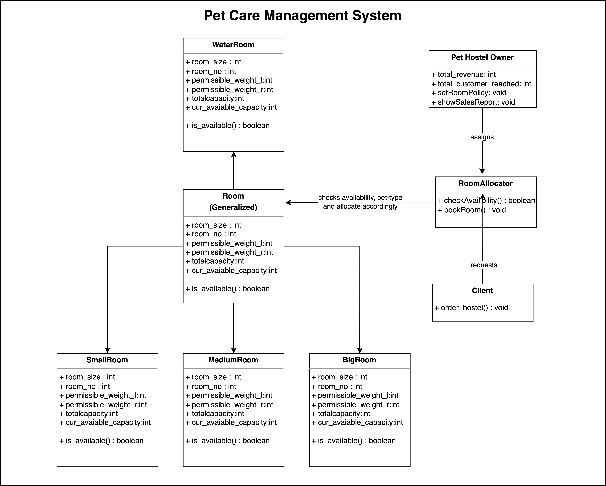
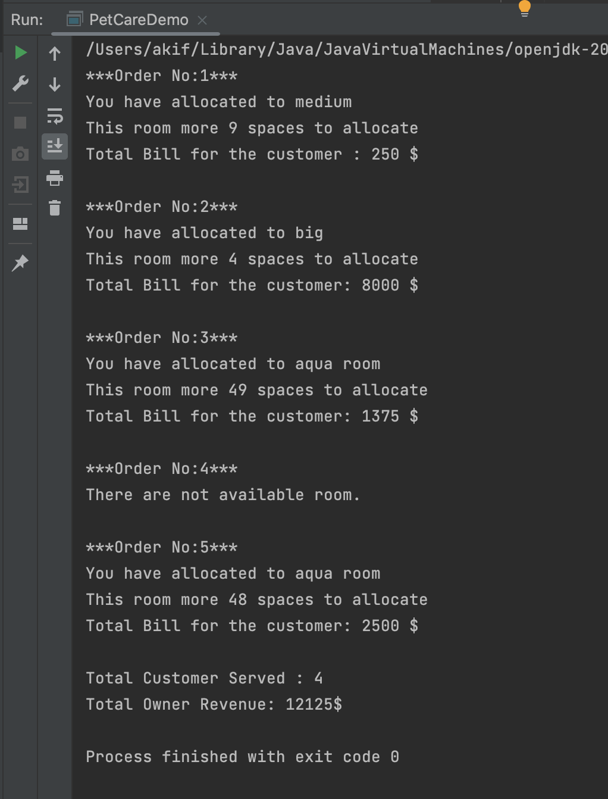

# A Pet-Hostel Management System with OOP


# Object Oriented Design and Design Patterns Lab<br> CSE 4122
## Author
Akif Islam<br>
Department of CSE, University of Rajshahi<br>
iamakifislam@gmail.com<br><br><br>

## Experiment 02
<p> Pet Mangement System</p>

## Story of the Program
<p>
The program is like a game that pretends to run a pet hotel. Imagine a pet hotel where there are three different roles. One person is the Pet Care Owner, who decides how many rooms there will be, where each pet should stay, and what features the hotel will have.

Then, there is a Room Allocator, like a manager, who talks to customers and takes their orders. Depending on the pet's size, weight, and type, this allocator checks which rooms are available and picks the right one.

After the customer places their order, they receive a bill. Meanwhile, the Pet Owner can see how many customers were served and how much money the hotel made.
</p>

## Class Diagram




## How to Run?
```bash
  $javac PetCareDemo.java
  $java PetCareDemo
```


## Room Division Policy
```java
/*PetCare authority creates 4 category rooms. They are small, medium, big and water room.
 *
 * ==========================
 * BIGROOM-1
 * - Capacity : 5 Animals
 * - Weight Alowed : 30 KG to 50KG
 * - Has Aquirium? : No
 * ==========================
 *
 * * ==========================
 * MEDIUM ROOM-2
 * - Capacity : 10 Animals
 * - Weight Alowed : 10 KG to 29KG
 * - Has Aquirium? : No
 * ==========================
 *
 * SMALL ROOM-3
 * - Capacity : 20 Animals
 * - Weight Alowed : 1 KG to 9 KG
 * - Has Aquirium? : No
 * ==========================
 *
 * AQUIRIUM-4
 * - Capacity : 50 Fishes
 * - Weight Alowed : 0.1 KG to 0.99 KG
 * - Has Aquirium? : YES
 * ==========================
 * */
```

## PetCareDemo
```java
    // Create Clients
    Client a = new Client();
    Client b = new Client();
    Client c = new Client();

    // Clients are ordering
    a.order_hostel(21.0,"bird",5);
    b.order_hostel(48.0,"tiger",100);
    c.order_hostel(0.5,"aqua",55);

    a.order_hostel(100,"aqua",4);
    a.order_hostel(0.5,"aqua",100);

```

## Output



